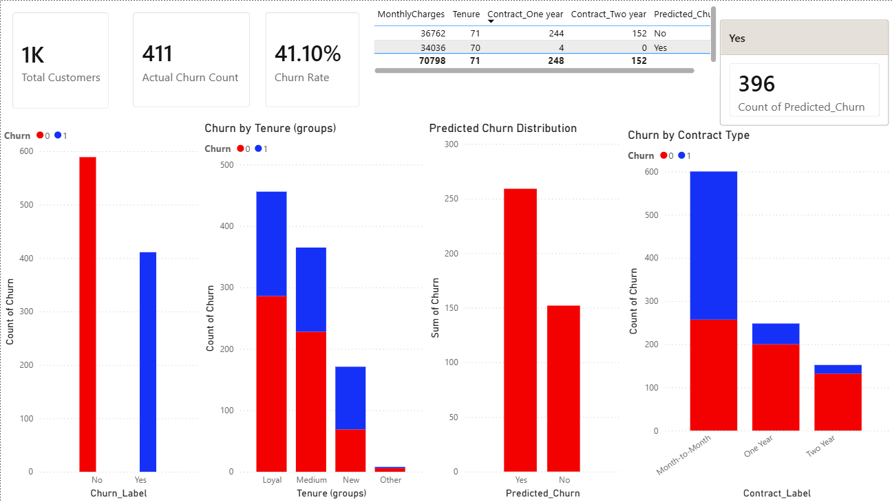

# Customer Churn Analysis (ML + Power BI)

## 📊 Project Overview

This project analyzes customer churn behavior and predicts customer attrition using Machine Learning. The results are visualized through an interactive Power BI dashboard.

## 🎯 Objective

To identify factors affecting customer churn and build a predictive model to help businesses reduce customer loss.

## 🛠 Tools & Technologies

* Python (Pandas, Scikit-learn)
* Machine Learning (Logistic Regression)
* Power BI
* Excel

## 📈 Key Features

* Data Cleaning & Preprocessing
* Exploratory Data Analysis (EDA)
* Churn Prediction Model (76% Accuracy)
* Interactive Power BI Dashboard
* High-Risk Customer Identification

## 📌 Key Insights

* Customers with month-to-month contracts have the highest churn rate
* Customers with low tenure are more likely to leave
* Higher monthly charges increase churn probability
* ML model helps identify high-risk customers

## 📷 Dashboard Preview

## 🚀 Conclusion

This project provides actionable insights and predictive capabilities to help businesses improve customer retention strategies.
